# 한국어 위협 대화 분류 (NLU : Natural Language Understanding)

## 개요
> **아이펠 DLthon 프로젝트** <br/> **프로젝트 기간: 2024.06.24 ~ 2024.06.27** <br/>
> **실험 결과 확인(wandb)** :
> - [https://wandb.ai/dogcat1943/text-multi-label-classification?nw=nwuserdogcat1943](https://wandb.ai/dogcat1943/text-multi-label-classification?nw=nwuserdogcat1943) <br>


## 팀원 소개

|                                                                김성연                                                                |                                                                이얼                                                                 |                                                               이은경                                                                |                                                                                                               
|:---------------------------------------------------------------------------------------------------------------------------------:|:---------------------------------------------------------------------------------------------------------------------------------:|:--------------------------------------------------------------------------------------------------------------------------------:| 
|  |  |  |
|                                           [@seongyeon1](https://github.com/seongyeon1)                                            |                                               [@L3earl](https://github.com/L3earl)                                                |                                               [@ek0111](https://github.com/ek0111)                                               |
|                                                         데이터 전처리, EDA, 모델링                                                         |                                                        실험 설계, 시스템 디자인, 모델링                                                        |                                                       데이터 전처리, 데이터 증강, 모델링                                                       |

<br>

---
## 프로젝트 소개
한국어 위협 대화 분류 (NLU : Natural Language Understanding)
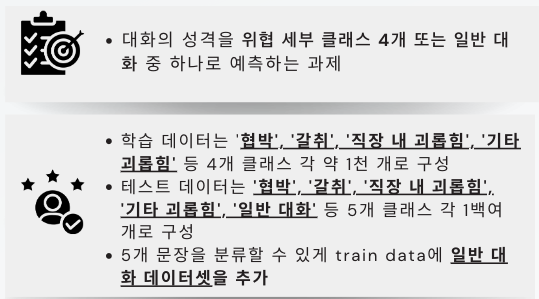

## 프로젝트 평가 항목
> 1. **데이터 EDA와 데이터 전처리가 적절하게 이뤄졌는가?**
> 2. **Task에 알맞게 적절한 모델을 찾아보고 선정했는가?**
> 3. **성능 향상을 위해 논리적으로 접근했는가?**
> 4. **결과 도출을 위해 여러가지 시도를 진행했는가?**
> 5. **도출된 결론에 충분한 설득력이 있는가?**
> 6. **적절한 metric을 설정하고 그 사용 근거 및 결과를 분석하였는가?**
> 7. **발표가 매끄럽게 진행되었고 발표 시간을 준수하였는지?**

<br>

---
## 사용 기술

### Environment


             

### Log
        

### Development


### Communication


<br>

---
## 협업
- 효과적인 협업을 위해 노션을 활용했다
- 첫 번째 회의 시간에 규칙을 정하고 정기 회의 시간을 정한 뒤 역할을 나눠서 진행했다

|    Task Board    |     To-Do-List     |
|:----------------:|:------------------:|
| 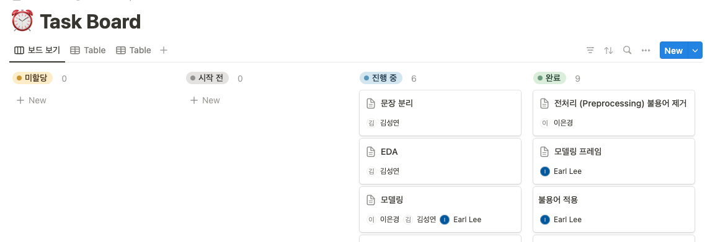 | 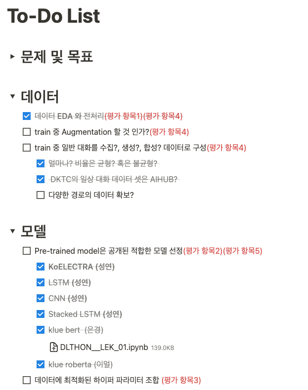 |  

<br>
---

## 실험 설계
### 로그 관리
- wandb를 통한 실험 결과 추적 및 비교를 용이하게 할 수 있었다

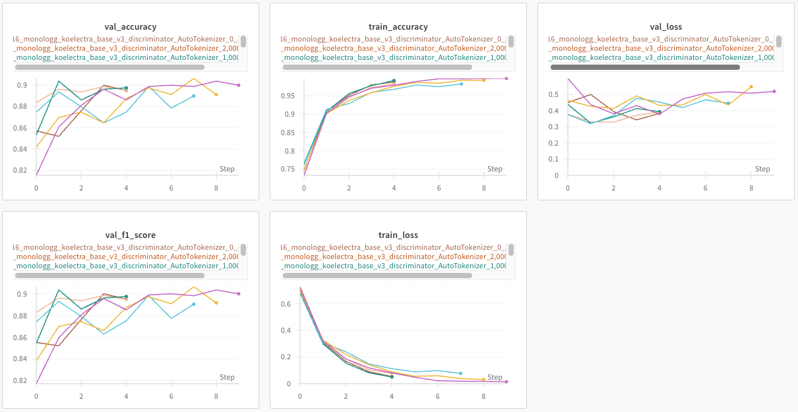

<br>

### 실험 정리
- 성능 평가를 좀 더 체계적으로 하기 위한 방법을 고안하였다
- 각자 모델링을 해보고 이에 따른 성능 비교를 할 수 있는 구조를 활용하였다.
- 각자 아이디어로 실험 > 전처리, 모델 모듈화 > 반복 수행 > 결과 비교로 인사이트 획득, 개선 점 토론 > 반복하는 구조로 실험을 진행하였다.
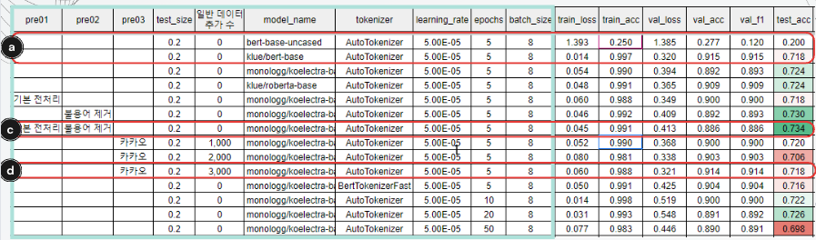

<br>

---

## EDA

### 형태소 분석
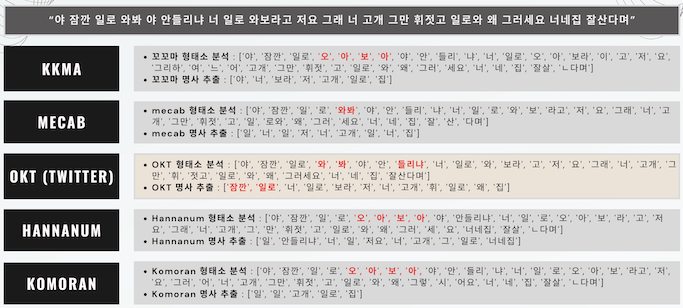

<br>

### 불용어 추가
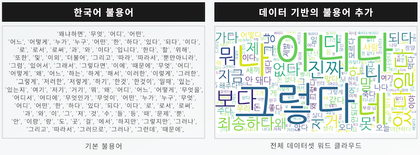
- 각 클래스별 워드 클라우드 및 자세한 내용은 ppt 폴더의 발표자료 참고

<br>

### 일반 데이터셋 추가
##### 1) 주제별 텍스트 일상 대화 데이터셋
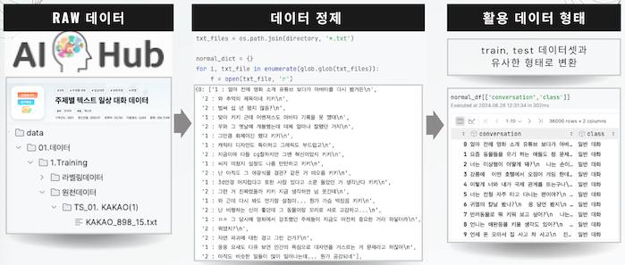
- 출처 및 설명 : https://aihub.or.kr/aihubdata/data/view.do?currMenu=115&topMenu=100&dataSetSn=543
##### 2) 국립국어원 일상 대화 음성 말뭉치 2021
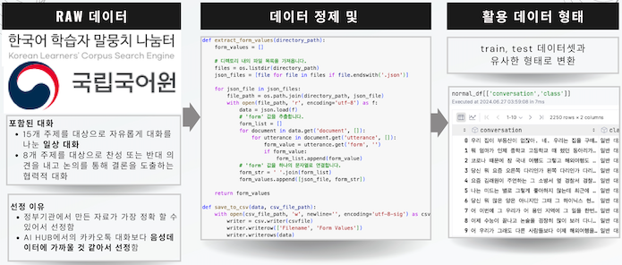
- 출처 및 설명 : https://81675795.ucloudcdnglobal.com/166/NIKL_Dialogue_2021_PCM_v1.1.pdf

<br>

## 모델링
- 아이펠 학습에서 사용했던 모델들과 최신 모델들을 활용해서 모델링을 진행했다
  - 사용 모델
    - `Baseline Model` : LSTM, 1D CNN
    - `Model from Scratch` : Transformer (Encoder), GPT
    - `Pre-trained Model` : koBert, koElectra, koRoberta
- 나온 결과들의 앙상블을 통해 성능을 최대화 하였다
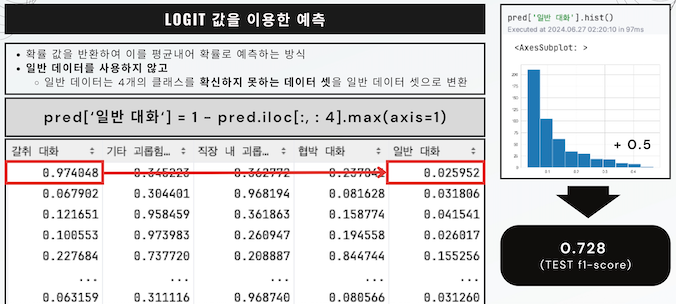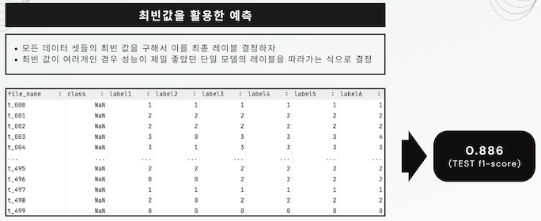

<br>

---
## 결론
- 전처리 측면에서 맞춤법 교정을 추가하면 좋을 것
- 단순 내용, 단어들 만으로 분류하는 것은 좋은 성능 내기 어려울 것으로 보임
  - **맥락, 대화 상대와의 관계**까지 고려할 수 있는 모델 설계가 필요함
- multi level task, auxiliary task 추가하면 좋은 성능 낼 것으로 기대
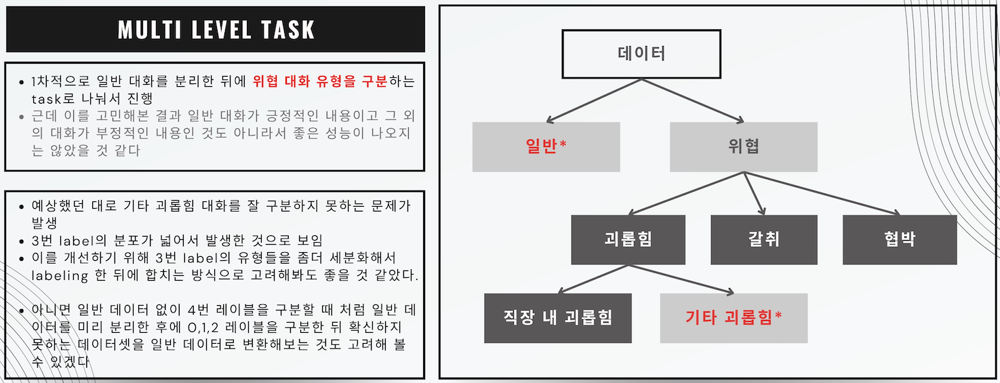
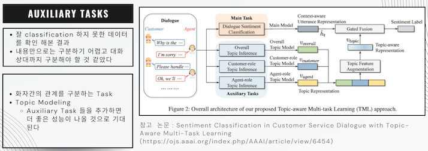

<br>

---
## 디렉토리 구조
```bash
├── README.md
├── data : 데이터 셋
├── data_paring : 추가 일반 데이터 수집 및 전처리 코드 
│   ├── ai_hub_parsing.ipynb : ai_hub 데이터를 사용하기 좋은 형태로 전처리 하는 코드
│   └── corpus_normal_data_paring.py : 국립국어원 말뭉치 데이터 전처리 코드
├── models: fine-tuning 한 모델들이 담긴 폴더 (용량문제로 삭제)
│   ├── koelectra_multilabel
│   └── train.py
├── pred : submission 형태로 저장하는 위치
├── utils : 전처리 및 불용어 관련 코드
├── ppt : 발표자료
└── notebook : 실험을 위한 jupyter notebook 파일들
    ├── EDA & Visualization.ipynb : EDA(형태소 분석) 및 시각화 (wordcloud, histogram) 
    ├── Modeling_~~ : 모델링 코드
    └── Modeling_bert.ipynb
```

